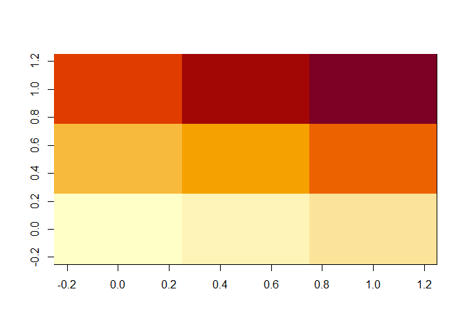
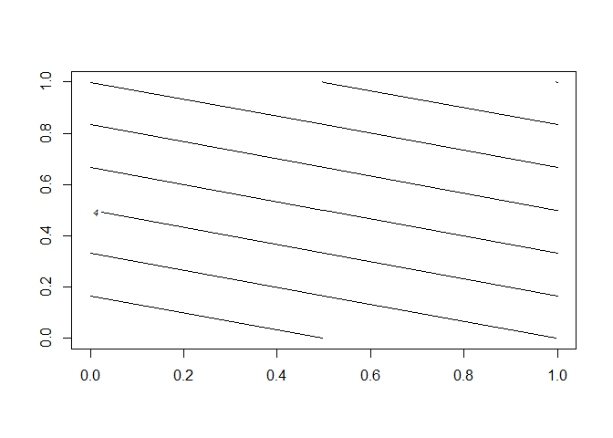
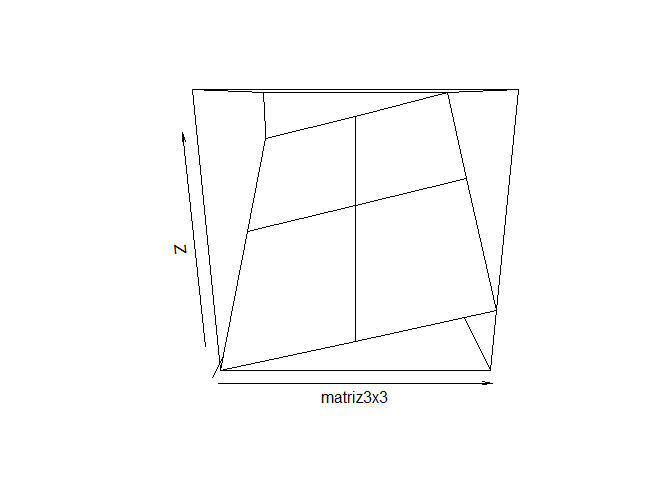
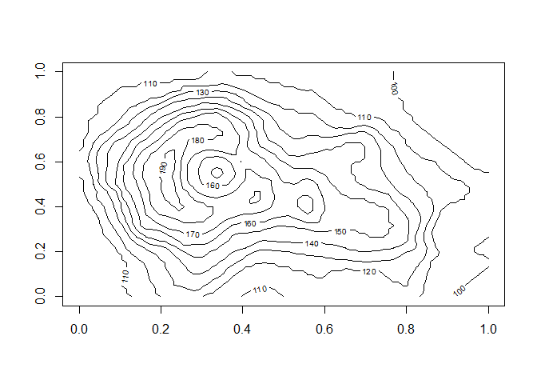
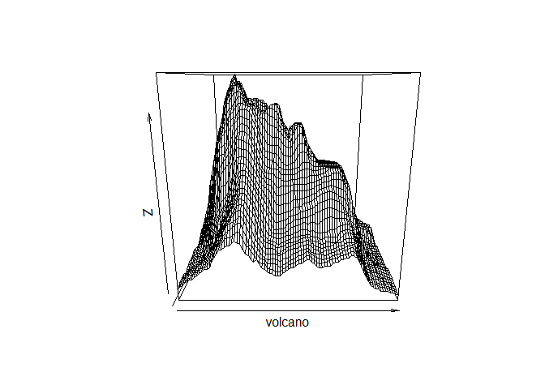

ReadMe - Aprendendo R e Rstudio
================

Aqui estão registradas minhas notas de aula do curso: [Linguagem R: do
zero absoluto ao domínio em menos de 7
horas](https://www.udemy.com/course/linguagemrdozeroaodominio/)

Este é um curso criado pelo professor [Isaías
Lira](https://www.udemy.com/course/linguagemrdozeroaodominio/#instructor-1)

Registrei aqui exemplos que do professor e exemplos que criei, assim
como informações que considerei mais relevantes, como informações de
**sintaxe**, pois como não trabalho com isso ainda, a sintaxe é o mais
fácil de se esquecer, já que entender o conceito constrói o
profissional.

Fica o convite para me conhecer!
[linkedIn](linkedin.com/in/diogo-josé-pereira-18a426124)

## Atalhos

| atalho                           | comando          |
|:---------------------------------|:-----------------|
| Rodar linha de código ou seleção | Ctrl + Enter     |
| Ajuda da função                  | ?nomeFuncao      |
| Limpar o Console                 | Ctrl + L         |
| knit para referência Rmarkdown   | Ctrl + Shift + K |

## Baixar e ativar pacotes

Usar a aba Packages, ou…

Exemplo para o pacote tseries pelo console  
**Baixar**

``` r
# install.packages("tseries")  
```

**Ativar**

``` r
# library(tseries)  
```

## Fazendo a citação do R

Informações encontradas no console pelo comando:

``` r
citation()
```

    ## 
    ## To cite R in publications use:
    ## 
    ##   R Core Team (2021). R: A language and environment for statistical
    ##   computing. R Foundation for Statistical Computing, Vienna, Austria.
    ##   URL https://www.R-project.org/.
    ## 
    ## A BibTeX entry for LaTeX users is
    ## 
    ##   @Manual{,
    ##     title = {R: A Language and Environment for Statistical Computing},
    ##     author = {{R Core Team}},
    ##     organization = {R Foundation for Statistical Computing},
    ##     address = {Vienna, Austria},
    ##     year = {2021},
    ##     url = {https://www.R-project.org/},
    ##   }
    ## 
    ## We have invested a lot of time and effort in creating R, please cite it
    ## when using it for data analysis. See also 'citation("pkgname")' for
    ## citing R packages.

## Demonstrações R

``` r
# demo(persp)
# demo(graphics)
```

## Aula 10 - Usando o R como calculadora

| Operações         | Sintaxe R            |
|:------------------|:---------------------|
| Soma              | 2 + 2<br>sum(2,2)    |
| Subtração         | 2 - 2                |
| Multiplicação     | 2 \* 2               |
| Divisão           | 2 / 2                |
| Resto             | 2 %% 2               |
| Resto inteiro ??? | 2 %/% 2              |
| Potência          | 2 ^ 2<br>2 \*\* 2    |
| Raiz Quadrada     | sqrt(4)              |
| logaritmo         | log(2)<br>log(2, 10) |
| fatorial          | factorial(5)         |
| módulo            | abs(-2)              |
| seno              | sin(90)              |
| cosseno           | cos(90)              |
| atribuição        | var1 &lt;- 2         |

## Aula 11 - Introdução aos objetos no R

vetores sequencias Matrizes Arrays Listas DataFrames

## Aula 14, 15, 16, 17 e 18 - Vetores

Entrada de valores em um vetor pelo Script

``` r
vetor <- c("valor1", "valor2")
vetor
```

    ## [1] "valor1" "valor2"

Pelo Console (Só para números reais, mas dá pra configurar *?scan*)

``` r
#vetor <- scan()
#1:  valor1
#2:  valor2
#3:  valor3
#4:
#>
```

Acessando/Modificando

``` r
vetor[1] = "Valor01"
vetor
```

    ## [1] "Valor01" "valor2"

``` r
vetor<-1:10
vetor[3:10]
```

    ## [1]  3  4  5  6  7  8  9 10

``` r
vetor[c(1, 4)]
```

    ## [1] 1 4

``` r
vetor[c(1, 4)] <- c(0, 90) # Substirui em vetor o conteúdo na posição 1 por 0 e na posição 4 por 90
vetor[-6] #Suprime o sexto elemento da impressão
```

    ## [1]  0  2  3 90  5  7  8  9 10

``` r
vetor = vetor[-6] #Remove o sexto elemento do vetor
```

| Operações                                                                            | Sintaxe R                       |
|:-------------------------------------------------------------------------------------|:--------------------------------|
| número de elementos                                                                  | length(vetor)                   |
| classificar                                                                          | sort(vetor)                     |
| classificar<br>decrescente                                                           | sort(vetor, decreasing = TRUE)  |
| média                                                                                | mean(vetor)                     |
| mediana                                                                              | median(vetor)                   |
| Desvio Padrão                                                                        | sd(vetor)                       |
| valor máximo                                                                         | max()                           |
| valor mínimo                                                                         | min()                           |
| União de elementos                                                                   | union(vetor1, vetor2)           |
| Intersecção de elementos                                                             | intersect(vetor1, vetor2)       |
| diferença entre elementos<br> \*os elementos do 1º retirando os que repetem com o 2º | setdiff(vetor1, vetor2)         |
| Possíveis combinações entre dois vetores                                             | interaction(vetor1, vetor2)     |
| **Possíveis combinações entre dois vetores**<br>\* **Exibição de forma facilitada**  | **expand.grid(vetor1, vetor2)** |
| soma dos elementos dentro do vetor<br>Similar ao reduce                              | sum(vetor)                      |
| encontrar elementos                                                                  | match(vetor, valor)             |

Obs.: Ao fazer uma operação com um vetor, essa operação se aplica a
todos os seus elementos.

## Aula 20 - Vetores Lógicos - Booleanos (Operações Lógicas)

Operações lógicas retornam TRUE ou FALSE.  
Essa informação pode ser usada para tratamentos lógicos em estruturas de
seleção ou repetição. Quando usada em vetores, se aplica a todos os
elementos, gerando um vetor booleano (vetor de trues e falses)

| Operações      | Sintaxe R |
|:---------------|:----------|
| maior          | a &gt; b  |
| maior ou igual | a &gt;= b |
| menor          | a &lt; b  |
| menor ou igual | a &lt;= b |
| igual          | a == b    |
| diferente      | a != b    |
| ou             | a \|\| b  |
| e              | a && b    |

## Aula 23 - Aplicação prática

``` r
#### Script para cadastro de clientes

### 1. Cadastro de nomes
# clientes <- scan(what = "String") *forma para um script
clientes <- c("Marcos de Aguiar", "Paula Miranda", "Emilio Santos", "Priscila de Albuquerque")

### 2. Atualização no cadastro
expand.grid(clientes) # Descubra o indice da alteração
```

    ##                      Var1
    ## 1        Marcos de Aguiar
    ## 2           Paula Miranda
    ## 3           Emilio Santos
    ## 4 Priscila de Albuquerque

``` r
clientes[4] <- "Pryscilla de Albuquerque" # corrige o cadastro do nome

### 3. Cadastro de salários
# salarios <- scan() *forma para um script
salarios <- c(4000, 2500, 1200, 3400)
salarios
```

    ## [1] 4000 2500 1200 3400

``` r
### 4. Atualizar o vetor salários para salários liquido (%30 a menos)

salarios <- salarios * (1 - 0.3)
salarios
```

    ## [1] 2800 1750  840 2380

## Aula 25 - Sequências

| notação                                                 | significado                                                                                      |
|:--------------------------------------------------------|:-------------------------------------------------------------------------------------------------|
| 15:20                                                   | sequencia de 15 a 20                                                                             |
| seq(1,25,0.5)                                           | sequencia de 1 a 25, acrescendo de 0.5 em 0.5                                                    |
| rep(vetor, 3, 2)<br>rep(vetor, times=3, each=2)         | sequencia com os elementos de vetor, repetindo 3x e cada repetição contem 2x o mesmo valor       |
| sample(1:30, 10, T)<br>sample(1:30, size=10, replace=T) | busca 10 amostras aleatórias na sequencia de 1 À 30, sem chance de escolher um elemento repetido |

Obs.: Ao fazer uma operação com uma sequência, essa operação se aplica a
todos os seus elementos.

``` r
# Execução do citado acima
15:20
```

    ## [1] 15 16 17 18 19 20

``` r
seq(1,25,0.5)
```

    ##  [1]  1.0  1.5  2.0  2.5  3.0  3.5  4.0  4.5  5.0  5.5  6.0  6.5  7.0  7.5  8.0
    ## [16]  8.5  9.0  9.5 10.0 10.5 11.0 11.5 12.0 12.5 13.0 13.5 14.0 14.5 15.0 15.5
    ## [31] 16.0 16.5 17.0 17.5 18.0 18.5 19.0 19.5 20.0 20.5 21.0 21.5 22.0 22.5 23.0
    ## [46] 23.5 24.0 24.5 25.0

``` r
rep(vetor, 3, 2)
```

    ## [1] 0 2

``` r
sample(1:30, 10, T)
```

    ##  [1] 23  6 19  4 29  8 25 22  4 13

## Aula 29, 30, 31, 32 - Matrizes

|  Gerando matriz<br>referenciando… | Sintaxe R                          |
|----------------------------------:|:-----------------------------------|
|             **vetor como coluna** | **cbind**(vetor1,vetor2)           |
|              **vetor como linha** | **rbind**(vetor1,vetor2)           |
| dados e nº de linhas e de colunas | matrix(data=dados, nrow=1, ncol=1) |

A matriz tem seu sistema de acesso aos valores feito por coordenadas,
funcionando de forma similar ao vetor. **matrix\[linha, coluna\]** -&gt;
aponta para um valor especifico da matriz  
**matriz\[linha,\]** -&gt; aponta para o conjunto de valores da linha
especificada(normalmente uma leitura de diferentes atributos)  
**matriz\[,coluna\]** -&gt; aponta para o conjunto de valores da coluna
especificada (normalmente os valores de um atributo de todas as
leituras)

Uma característica que diferencia matriz de dataframe é que a matriz
assume todos os valores de linhas e colunas em um mesmo tipo.

Assim sendo, caso se opte por trabalhar com matrizes de diferentes tipos
de dados é necessário tratar os números.

``` r
a<-"10"
# a*2 dá erro: Error in a * 2 : non-numeric argument to binary operator

a<-as.numeric(a) # trata o armazenado em String de texto para armazenado como número
# assim como os as.numeric, existem muitos outras formas de coerção do tipo de dado, vale a pena consultar os as.

a*2
```

    ## [1] 20

## Aula 33 - Operações com Matrizes

| Operações                        | Sintaxe R                                                                      |
|:---------------------------------|:-------------------------------------------------------------------------------|
| Descobrir as dimensões da matriz | dim(matrix)<br>retorna vetor duas posições<br>\[1\] = nLinhas,\[2\] = nColunas |
| Descobrir o número de linhas     | dim(matrix)\[1\]<br>nrow(matrix)                                               |
| Descobrir o número de colunas    | dim(matrix)\[2\]<br>ncol(matrix)                                               |
| Produto matricial                | matrix1 %\*% matrix2                                                           |
| Determinante                     | det(matrix)                                                                    |
| Traspor                          | t(matriz)                                                                      |
| Mudar nome das linhas            | rownames(matriz) &lt;- vetorNomeLinhas                                         |
| Mudar nome das colunas           | colnames(matriz) &lt;- vetorNomeColunas                                        |

média e soma(mean(matrix) e sum(matrix)) funcionam de forma similar ao
com vetores

Obs.: Ao fazer uma operação com uma matriz, essa operação se aplica a
todos os seus elementos.

``` r
# Exemplo de criação
matriz3x3<-matrix(1:9, ncol = 3,nrow = 3)
matriz3x3
```

    ##      [,1] [,2] [,3]
    ## [1,]    1    4    7
    ## [2,]    2    5    8
    ## [3,]    3    6    9

Curiosidades:

``` r
image(matriz3x3)
```

<!-- -->

``` r
contour(matriz3x3)
```

<!-- -->

``` r
persp(matriz3x3)
```

<!-- -->

``` r
contour(volcano)
```

<!-- -->

``` r
persp(volcano)
```

<!-- -->

## Aula 35 - Resolvendo equações

``` r
# para equação do primeiro grau (ax=b)
## 5x=25
a<-5
b<-25
solve(a,b)
```

    ## [1] 5

``` r
# para sistemas do primeiro grau(ax+by=c) *Resposta vetor solução[1]=x, solução[2]=y 
## x + y = 20
a1<-1
b1<-1
c1<-20
## 3x + 4y = 72
a2<-3
b2<-4
c2<-72
linha1<- c(a1,b1,c1)
linha2<- c(a2,b2,c2)
matriz<-rbind(linha1, linha2)
solve(matriz[,1:2],matriz[,3])
```

    ## [1]  8 12

## Aula 38, 39, 40, 41 e 42 - Arrays

Assim como é possível unir as informações de diversos vetores em uma
matriz, é possível unir as informações de diversas matrizes em um array.

O array assim como as estruturas anteriores devem ter o mesmo tipo de
dado.  
E o sistema para acessar os dados funciona por posição de maneira
complementar ao sistema de vetor e de matriz: **array\[linha, coluna,
matriz\]**  
Caso você tenha declarado o nome da linha, da coluna ou da matriz, é
possível referenciar-la pelo nome entre "".  
Vale a pena dizer que é possível montar novas matrizes referenciando as
informações entre arrays.

``` r
# Estrutura de montagem do array
array(data = NA, dim = length(data), dimnames = NULL) # montagem padrão
```

    ## [1] NA

| Argumentos | Descrição                                                                  |
|:-----------|:---------------------------------------------------------------------------|
| data       | Informações para o array como:<br>sequência, vetor ou matriz.              |
| dim        | Vetor com as dimensões do array dim = c(nLinhas, nColunas, nMatiz)         |
| dimnames   | Lista contendo vetores com os nomes das linhas, das colunas e das matrizes |

## Aula 33 - usando Apply para operações com Arrays

O Apply é uma boa função para reduzir o código necessário para operações
com Arrays.

``` r
# Estrutura de montagem do array
# apply(X, MARGIN, FUN, ..., simplify = TRUE)
```

| Argumentos | Descrição                                                                                                                                                                                        |
|:----------:|:-------------------------------------------------------------------------------------------------------------------------------------------------------------------------------------------------|
|     x      | um array incluindo uma matriz                                                                                                                                                                    |
|   MARGIN   | valor ou vetor de referência para operação<br>1=todas as linhas<br>2=todas as colunas<br>c(1,2)=todas as linhas X colunas<br>c(1,3) todas as linhas X Matriz<br>c(2,3) todas as colunas X Matriz |
|    FUN     | Funções possíveis, sum por exemplo soma os elementos<br>até aqui conheço **sum** e **mean** com funcionalidades próximas a *steam.()Reduce()*                                                    |
|  simplify  | quando = TRUE, demostra os valores de forma mais amigável, próximo a tabela                                                                                                                      |

## Aula 47 - Instalando “Forcats”

``` r
# install.packages("forcats")
```

## Aula 48, 49, 50, 51 - Fatores

Fatores são variáveis que possuem níveis e permitem classificar os dados

Acessamos os valores da mesma forma que em um vetor.

Mesmo que sejam usados números para passar uma ordem, estes ainda são
rótulos para classificação e não aceitam operações matemáticas.

Quando criamos um fator de números, a ordem dos níveis se dá pelo valor
do número, agora quando criamos um fator de Strings(Nomes, palavras), a
ordem dos níveis se dará inicialmente pela ordem alfabética (podemos
mudar isso).

Para a criação podemos já criar um elemento como fator ou monta-lo como
um vetor de “Strings”e transforma-lo em fator

``` r
# Direto com factor
factor(c("1","1","2","2","3"))
```

    ## [1] 1 1 2 2 3
    ## Levels: 1 2 3

``` r
# montando um vetor e tratando-o como fator
vetor<-c("1","1","2","2","3")
as.factor(vetor)
```

    ## [1] 1 1 2 2 3
    ## Levels: 1 2 3

Outras funções do R

|   Função    | Descrição                                     |
|:-----------:|:----------------------------------------------|
| **str(a)**  | Descreve o conteúdo e a estrutura do objeto a |
| **plot(a)** | Imprime o gráfico referente ao objeto a       |

Operações com farotes

Para operações com fatores usamos a biblioteca forcats

|                                                                Função                                                                 | Descrição                                                                                                                                                                                                                 |
|:-------------------------------------------------------------------------------------------------------------------------------------:|:--------------------------------------------------------------------------------------------------------------------------------------------------------------------------------------------------------------------------|
|                                                        fct\_c(fator1, fator2)                                                         | Concatena os fator1 com fator2                                                                                                                                                                                            |
|                                       levels(fator1) &lt;- c(“Rótulo 1”,“Rótulo 2”,“Rótulo 3”)                                        | substitui o valor dos níveis de fator1 pelos rótulos declarados                                                                                                                                                           |
|                                      lvls\_revalue(fator1, c(“Rótulo 1”,“Rótulo 2”,“Rótulo 3”))                                       | gera um novo fator, com os rótulos declarados substituindo os níveis<br>Obs.: Como não é especificado qual nível é qual rótulo, a ordem é importante                                                                      |
|                                lvls\_recode(fator1, RotuloVelho1=“Rótulo 1”,RotuloVelho3=“Rótulo 3”))                                 | gera um novo fator, substituindo apenas os níveis especificados                                                                                                                                                           |
| fct\_collapse(fator1, Rotulo1=c(“Sub-RotuloA”,“Sub-RotuloB”,“Sub-RotuloC”)<br>,Rotulo2=c(“Sub-RotuloD”,“Sub-RotuloE”,“Sub-RotuloF”) ) | gera um novo fator, reduzindo os sub-níveis(A,B,C & D, E, F) em níveis mais genéricos (1 & 2)                                                                                                                             |
|                                            fct\_lump(fator1,**2**,other\_level = “Outros”)                                            | gera um novo fator, permitindo o agrupamento das ocorrências menos frequentes de diversos níveis em um único nível “Outros”, os **2** mais frequentes não são alterados                                                   |
|                                         fct\_relevel(Fator1,c(“RótuloA”,“RótuloB”,“RótuloC”))                                         | gera um novo fator, reordenando os níveis para o indicado na sequencia do vetor de rótulos                                                                                                                                |
|                          fct\_reorder(fator1,vetorValores1, sum)<br>fct\_reorder(fator1,vetorValores1, mean)                          | gera um novo fator, reordenando os níveis considerando cada elemento do fator1 relacionado com o VetorValores1 reduzindo estes valores aos níveis e aplicando a operação escolhida para classificar a ordem destes níveis |

## Teste 06

Neste teste há referência a função gl (Generate Factor Levels). Segue
seu uso abaixo:

``` r
# gl(n, k, length = n*k, labels = seq_len(n), ordered = FALSE) *construção padrão
# Exemplo
gl(2,3,labels = c("Aprovado","Reprovado"))
```

    ## [1] Aprovado  Aprovado  Aprovado  Reprovado Reprovado Reprovado
    ## Levels: Aprovado Reprovado

| Argumentos | Descrição                               |
|:----------:|:----------------------------------------|
|     n      | numero de níveis                        |
|     k      | numero de repetição                     |
|   labels   | Vetor sugerindo os rótulos para o fator |

## Aula 59 - Criação de Listas

Lista é um tipo de objeto que aceita diferentes tipos e tamanho de
objetos.

Diferentemente de vetor, matriz ou array. Uma lista pode ter valores de
diferentes tipos.

### Exemplos criação de Lista

``` r
# Simples cadastro de objetos para exemplo
vetorInteiro1<-1:6
vetorString2<-c("João Carlos","Augusto Ferreira","Maria Elena","Julia Mendes","Eduarda Perrela", "Carlos Daniel")
vetorBooleano<-c(TRUE,FALSE,FALSE,TRUE,TRUE,FALSE)
fatorOrdinal<-gl(2,3,labels = c("Aprovado","Reprovado"))
matrizInteiros<-matrix(nrow = 3, ncol = 3)

# Criação de lista
list(vetorInteiro1,vetorString2,vetorBooleano, matrizInteiros, fatorOrdinal) ## itens não nomeados
```

    ## [[1]]
    ## [1] 1 2 3 4 5 6
    ## 
    ## [[2]]
    ## [1] "João Carlos"      "Augusto Ferreira" "Maria Elena"      "Julia Mendes"    
    ## [5] "Eduarda Perrela"  "Carlos Daniel"   
    ## 
    ## [[3]]
    ## [1]  TRUE FALSE FALSE  TRUE  TRUE FALSE
    ## 
    ## [[4]]
    ##      [,1] [,2] [,3]
    ## [1,]   NA   NA   NA
    ## [2,]   NA   NA   NA
    ## [3,]   NA   NA   NA
    ## 
    ## [[5]]
    ## [1] Aprovado  Aprovado  Aprovado  Reprovado Reprovado Reprovado
    ## Levels: Aprovado Reprovado

``` r
list(nome=vetorString2, cadastro=vetorBooleano, vendas=vetorInteiro1) ## itens nomeados
```

    ## $nome
    ## [1] "João Carlos"      "Augusto Ferreira" "Maria Elena"      "Julia Mendes"    
    ## [5] "Eduarda Perrela"  "Carlos Daniel"   
    ## 
    ## $cadastro
    ## [1]  TRUE FALSE FALSE  TRUE  TRUE FALSE
    ## 
    ## $vendas
    ## [1] 1 2 3 4 5 6

## Aula 60 - Nomeando Elementos de Listas

``` r
#Montando lista sem nomear
lista1<-list(c(20,40,6),c("Laranja","Banana","Melancia"))
lista1
```

    ## [[1]]
    ## [1] 20 40  6
    ## 
    ## [[2]]
    ## [1] "Laranja"  "Banana"   "Melancia"

``` r
#Nomeando lista pronta
names(lista1)<-c("qtde","Fruta")
lista1
```

    ## $qtde
    ## [1] 20 40  6
    ## 
    ## $Fruta
    ## [1] "Laranja"  "Banana"   "Melancia"

``` r
#Montando lista e nomeando
lista2<-list(qtde=c(10,30,70),Fruta=c("Caqui","Limão","Jabuticaba"))
lista2
```

    ## $qtde
    ## [1] 10 30 70
    ## 
    ## $Fruta
    ## [1] "Caqui"      "Limão"      "Jabuticaba"

## Aula 61, 62 e 63 - Acessando e alterando os elementos de uma lista

Para acessar um elemento da lista se usa a notação $ para nome
ou\[\[\]\] para posição

Dentro de cada elemento, é respeitada sua forma de acessar os valores

``` r
lista1[[1]]  # Notação para acessar o 1º elemento de lista
```

    ## [1] 20 40  6

``` r
lista1$qtde # Notação para acessar o elemento de nome Nome1
```

    ## [1] 20 40  6

``` r
lista1$Fruta # Notação para acessar o elemento de nome Nome1
```

    ## [1] "Laranja"  "Banana"   "Melancia"

``` r
# lista1$NomeMatriz1[2,3]  notação para acessar o valor na linha 2 e coluna 3 da Matriz NomeMatriz1 dentro de lista
lista1[[3]]<-c("String1", "String2") #Substitui ou acrescenta ao 3º elemento com um vetor contendo duas Strings
lista1
```

    ## $qtde
    ## [1] 20 40  6
    ## 
    ## $Fruta
    ## [1] "Laranja"  "Banana"   "Melancia"
    ## 
    ## [[3]]
    ## [1] "String1" "String2"

``` r
lista1<-lista1[-3] #Remove 2º elemento da lista
lista<-c(lista1, lista2) # Combina os elementos da lista1 com os elementos da lista2 em uma unica lista
lista
```

    ## $qtde
    ## [1] 20 40  6
    ## 
    ## $Fruta
    ## [1] "Laranja"  "Banana"   "Melancia"
    ## 
    ## $qtde
    ## [1] 10 30 70
    ## 
    ## $Fruta
    ## [1] "Caqui"      "Limão"      "Jabuticaba"

``` r
unlist(lista) #Transforma o conteudo da lista em um vetor
```

    ##        qtde1        qtde2        qtde3       Fruta1       Fruta2       Fruta3 
    ##         "20"         "40"          "6"    "Laranja"     "Banana"   "Melancia" 
    ##        qtde1        qtde2        qtde3       Fruta1       Fruta2       Fruta3 
    ##         "10"         "30"         "70"      "Caqui"      "Limão" "Jabuticaba"

## Aula 68, 69, 72, 73, 74 e - DataFrame

Listas estão para vetores assim como DataFrames estão para matrizes.  
O Dataframe atende a necessidade de se trabalhar com diferentes dipos de
dados em um fomato de tabela, já que a matriz só aceita elementos do
mesmo tipo

O acesso aos valores se dá de forma similar a forma de matriz, podendo
também ser combinado com a notação de listas ($, \[\[\]\])

``` r
#dataframe1<-as.data.frame(matriz1)    *convertendo dados de uma matriz em um dataframe
#dataframe1<-data.frame(NomeCol1=VetorString1,NomeCol2=VetorInteiros2)    *Criando um dataframe com o método proprio
```

## Aula 75 - Operações para DataFrame

| Operações                                         | Sintaxe R                                                 |
|:--------------------------------------------------|:----------------------------------------------------------|
| Numero de colunas                                 | ncol(dataframe1)                                          |
| Numero de linhas                                  | nrow(dataframe1)                                          |
| Vetor de Dimensões<br>\[1\]=linhas, \[2\]=colunas | dim(dataframe)                                            |
| numero de linhas de uma coluna                    | length(dataframe1$ColunaVetor1)                           |
| names(dataframe1)                                 | Nome de todas as variáveis(Colunas)                       |
| view(dataframe1)                                  | Visualização facilitada em tabela do dataframe1           |
| summary(dataframe1)                               | Resumo com descrição das variáveis(Colunas) de dataframe1 |

## Aula 82 e 83 - Loop For()

``` r
# Sintaxe for
for (i in 1:3) {
  cat("Estrutura de repetição for, esta é a execução nº", i,"\n")
}
```

    ## Estrutura de repetição for, esta é a execução nº 1 
    ## Estrutura de repetição for, esta é a execução nº 2 
    ## Estrutura de repetição for, esta é a execução nº 3

## Aula 84 - Loop while()

``` r
# Sintaxe while
x<-TRUE
while (x==TRUE) {
  cat("Executado", x,"\n")
  x<-FALSE
}
```

    ## Executado TRUE

``` r
cat("Saí do laco?", !x)
```

    ## Saí do laco? TRUE

## Aula 85 - Condicional If

``` r
# Sintaxe if
if (10>20) {
  print("Baita absurso!")
}
```

## Aula 86 - Condicional Else

``` r
# Sintaxe If Else
print("10 é maior que 20?")
```

    ## [1] "10 é maior que 20?"

``` r
if (10>20) {
  print("Baita absurso!")
}else {
  print("Não, 10 não é maior que 20")
}
```

    ## [1] "Não, 10 não é maior que 20"

## Aula 89 - Criando funções

``` r
# Sintaxe de function()
soma <- function(arg1, arg2){
  valor<-arg1 + arg2
  cat("Soma dos dois valores =",valor,"\n")
  return (valor)
}

soma(1,1)
```

    ## Soma dos dois valores = 2

    ## [1] 2
